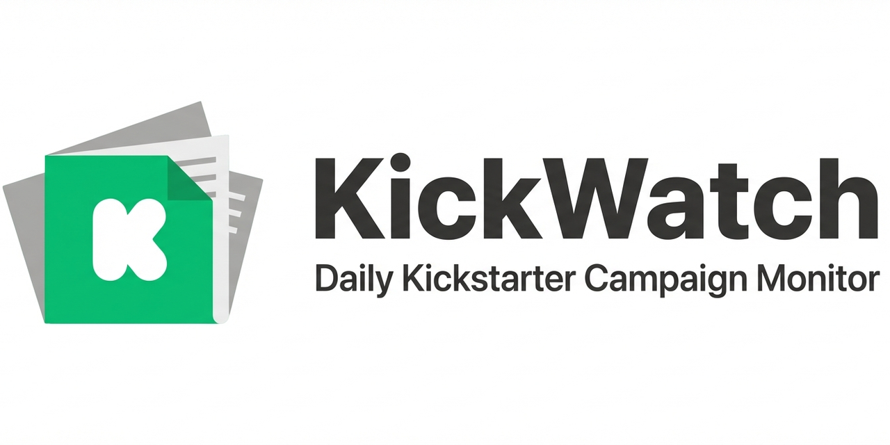

# KickWatch

Daily Kickstarter campaign monitor. Get push notifications when campaigns you care about go live.

[](https://github.com/ReScienceLab/KickWatch/actions/workflows/test-backend.yml)
[](https://github.com/ReScienceLab/KickWatch/actions/workflows/deploy-backend.yml)

## Overview

KickWatch is an iOS app + Go backend that monitors Kickstarter for new campaigns and alerts you when they match your saved keywords or categories.

- **Nightly crawl** — Go cron job scrapes all Kickstarter root categories at 02:00 UTC via the REST API
- **Keyword alerts** — Create alerts with keywords; matching campaigns trigger APNs push notifications
- **Discover** — Browse and filter live campaigns by category and sort order
- **Watchlist** — Heart campaigns to save them and track their funding progress

## Tech Stack

| Layer | Stack |
|---|---|
| iOS | SwiftUI · SwiftData · iOS 17+ |
| Backend | Go 1.24 · Gin · GORM · PostgreSQL |
| Infra | AWS ECS (Fargate) · RDS · Secrets Manager · ALB |
| CI/CD | GitHub Actions |
| Push | APNs (Apple Push Notification service) |

## Project Structure

```
├── ios/                    → SwiftUI app
│   ├── KickWatch/Sources/
│   │   ├── App/            → Entry point, ContentView
│   │   ├── Models/         → SwiftData models
│   │   ├── Views/          → UI views (Discover, Watchlist, Alerts, Search, Settings)
│   │   ├── ViewModels/     → View models
│   │   └── Services/       → APIClient, NotificationService
│   └── project.yml         → XcodeGen config (source of truth)
└── backend/                → Go API server
    ├── cmd/api/            → Entry point
    └── internal/
        ├── handler/        → HTTP handlers
        ├── service/        → Kickstarter REST/GraphQL clients, APNs, cron
        ├── model/          → GORM models
        ├── config/         → Configuration
        └── middleware/     → Logging, error handling
```

## Getting Started

### Backend

```bash
cd backend
cp .env.example .env  # fill in values
go run ./cmd/api
```

### iOS

```bash
cd ios
xcodegen generate
open KickWatch.xcodeproj
```

### Tests

```bash
cd backend && go test ./...
```

## API Endpoints

| Method | Path | Description |
|---|---|---|
| GET | `/campaigns` | List campaigns (paginated) |
| GET | `/campaigns/search` | Search campaigns |
| GET | `/categories` | List Kickstarter root categories |
| POST | `/devices` | Register device for push notifications |
| GET/POST/DELETE | `/alerts` | Manage keyword alerts |

## Environment Variables

See [`backend/.env.example`](backend/.env.example) for the full list. Secrets are injected via AWS Secrets Manager in production.

## Deployment

The backend deploys automatically to AWS ECS on push to `main` via GitHub Actions. See [`.github/workflows/deploy-backend.yml`](.github/workflows/deploy-backend.yml).

- **API (prod):** `https://api.kickwatch.rescience.com`
- **API (dev):** `https://api-dev.kickwatch.rescience.com`

## License

MIT
